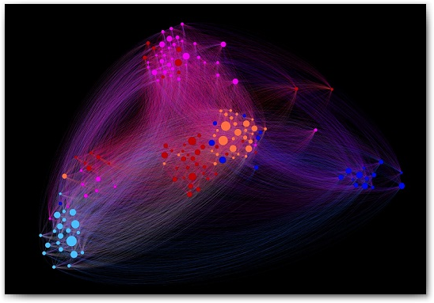

# Networks in Economics Research

## Authors
- Chia Yang Jin
- Ren Yang
- Ong Sze Swee

## Project Description
The [JEL classification system](https://en.wikipedia.org/wiki/JEL_classification_codes) was developed in 1991 for use in the Journal of Economic Literature (JEL), and has become the standard method of classifying scholarly literature in the field of economics. Each paper is assigned single/multiple JEL codes by the authors that act as tags of the research area the paper is concerned with. All JEL tags and publication metadata is obtained from RePEc, an open decentralised bibliographic database of working papers and journals.

We wanted to see how the fields of economics research have evolved over time. Each node describes a single JEL code in the syntax of X00, where X represents a top-level research field and the two-digit suffix represents the sub-disciplines within that field. An edge is added between two JEL codes (nodes) whenever a paper tags both JEL codes; its weight represents how many papers have co-tagged those two JEL codes. Naturally, our network would be undirected and weighted.

## Network Metrics
- Nodes: 779
- Edges: 122311
- Average Degree: 314
- Average Weighted Degree: 3707
- Average Clustering Coefficient: 0.632
- Modularity (Q, Qmax) (Grouped according to JEL top-level code): -0.03695, 0.73634
- Average Shortest Path Length: 1.597
- Diameter: 3

## Technical Details
We removed JEL codes of X*9 as these codes refer to “Others” and is not descriptive nor helpful to us at all in learning about the genealogy of economics research. Self-loops within the network are also culled (usually the result of poor metadata), as are papers with incorrect publication date.

In order to get more relevant results, we formulate a normalised edge weight method that is more robust to changes over time and tracks overall proportion of papers that contain the linked JEL codes (normalised edge weight can range from 0 to 1). This is used in our analysis of the evolution of the edge weights of specific JEL codes (nodes) over time.

To obtain plots of degree distribution, run 'generateDdist.m'. Plots of PageRank vs Time, PageRank vs No. of Papers, Normalised Edge Weight vs Time are in their respective Excel spreadsheets.

## Data Sources/Organisations
- [JEL classification codes (XML file)](https://www.aeaweb.org/econlit/classificationTree.xml)
- [RePEc (EconsPapers)](http://econspapers.repec.org) (currently blocked in SUTD, sorry!)
- [RePEc (IDEAS)](https://ideas.repec.org/getdata.html) (secondary source, data obtained with supplied Perl scripts [setup instructions on website])

## Notes
- Special thanks to [Justin Ruths](http://me.utdallas.edu/people/ruths.html)
